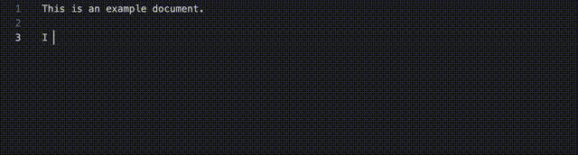

# lm-writing-tool README

After Grammarly disabled its API, there is no similar grammar checking tool for VSCode. While [LTeX](https://marketplace.visualstudio.com/items?itemName=valentjn.vscode-ltex) catches spelling mistakes, it does not reach the level of understanding of Grammarly.

This extension is a simple attempt to fill the gap through large language models (LLM). It chunks the text into paragraphs, asks an LLM to proofread each paragraph, and then highlights the errors. The user can then click on the error to see the suggested correction.

## Features

Choose from local llama3.2 or gpt-40-mini through [VSCode LM api](https://code.visualstudio.com/api/extension-guides/language-model).

